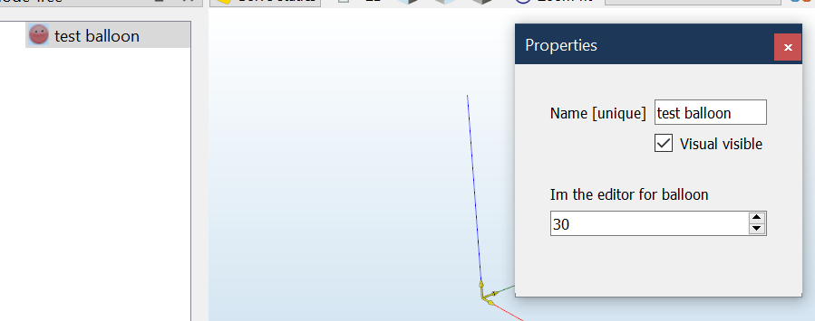

# Expanding DAVE

When adding (proprietary) elements to DAVE you may want to extend the GUI without
changing the source-code of DAVE itself.

Add:
- workspaces
- dockwidgets
- nodes


## Making new node-types available when running code

DAVE executes python code when importing files, copying the scene or adding nodes.

New classes need to be made available to the environment when running code in order to be usable.

This is done by adding them to a global setting `DAVE_ADDITIONAL_RUNTIME_MODULES`:
```python
# Add the balloon class to the modules that are available when executing code

from DAVE.settings import DAVE_ADDITIONAL_RUNTIME_MODULES
DAVE_ADDITIONAL_RUNTIME_MODULES['Balloon'] = Balloon
```

## Creating a new dock

Docks are floating or docked sub-windows of the main GUI. Everything except the 3d view-port and the menu is a dock.

Docks are QtWidgets derived from `guiDockWidget` 

Docks are created and activated by main. Upon creation they receive some references to things in the gui:

```python
d.guiScene = self.scene
d.guiEmitEvent = self.guiEmitEvent
d.guiRunCodeCallback = self.run_code
d.guiSelectNode = self.guiSelectNode
d.guiSelection = self.selected_nodes
d.guiPressSolveButton = self.solve_statics
d.gui = self
```

Communication between the docks is done via the `guiEmitEvent` which can send any of the ENUMs defined in `guiEventType`. Handling of these events is to be implemented in guiProcessEvent.

#### Registering

Any dock needs to be added to the `DAVE_GUI_DOCKS` dictionary.  The keys in this dictionary are strings. These strings are also used as the dock-window title.

```python
from DAVE.gui.dockwidget import DAVE_GUI_DOCKS
DAVE_GUI_DOCKS['Balloon'] = BalloonDock
```

#### Activating a dock

See workspaces


## Integrating into the main gui

Code can be executed at various moment by defining plugin-functions and adding a reference to that function to a globally available list.

### Init

plugin_init is executed at the end of the .__init__ function.
It takes a single parameter being the instance of the Gui that is being intialized (
the `self` of the init function)

```python
def my_function(gui):
	print('executed on startup')

from DAVE.gui.main import DAVE_GUI_PLUGINS_INIT
DAVE_GUI_PLUGINS_INIT.append(my_function)
```


### Workspaces

The user can activate a workspace by pressing one of the buttons at the top side of the interface. Internally a workspace is identified by an WORKSPACE_ID which is a unique, upper-case string.

#### Adding a button

Adding a button can be done by adding (or inserting) an entry to the DAVE_GUI_WORKSPACE_BUTTONS list. This is a tuple where the first entry is the text on the button and the second entry is the workspace id

```PYTHON
from DAVE.gui.main import DAVE_GUI_WORKSPACE_BUTTONS
DAVE_GUI_WORKSPACE_BUTTONS.append('BaLLoooon !', 'BALLOON')

```


#### Activating the workspace

Workspaces are controlled by the "activate_workspace" function. This function typically creates one of more dockwidgets.

A plugin can be registered in `DAVE_GUI_PLUGINS_WORKSPACE`

```python
def plugin_activate_workspace(gui, workspacename):
    print('calling activateworkspace')
    if workspacename.upper() == 'BALLOON':
        gui.show_guiWidget('Balloon')  # <-- ID of the balloon dock

from DAVE.gui.main import DAVE_GUI_PLUGINS_WORKSPACE
DAVE_GUI_PLUGINS_WORKSPACE.append(my_function)
```


### Context-menu

The context-menu is the right-click menu. This is used to add nodes. A plugin here has the following signature:

```
openContextMenyAt(menu, node_name, gui)
```

the plugin gets called with the following arguments:

1. QMenu object
2. The name of the first selected node (if any)
3. A reference to the main gui

the reference to the main gui can be used to run code as follows:
```python
def plugin_context(menu, node_name,gui):
    code = 'Balloon(s, s.available_name_like("new_balloon"))'
    def action():
        gui.run_code(code, guiEventType.MODEL_STRUCTURE_CHANGED)

    BalloonIcon = QIcon(str(Path(__file__).parent / 'balloon.png'))

    action = menu.addAction("Add balloon", action)
    action.setIcon(BalloonIcon)
```

The plugin needs to be registered in:

```python
from DAVE.gui.main import DAVE_GUI_PLUGINS_CONTEXT
DAVE_GUI_PLUGINS_CONTEXT.append(plugin_context)
```


## Editing nodes

Selecting a node while in "construction" makes the "Properties" dock-widget visible.


### Extending the node-editor

Sections in the node-propeties widget derive from `NodeEditor`

1. Create a new `MyNewNodeEditor` class which derives from `NodeEditor`
2. Register the node-editor class against the node-instances for which the editor should open.

```python
from DAVE.gui.widget_nodeprops import DAVE_GUI_NODE_EDITORS
DAVE_GUI_NODE_EDITORS[Balloon] = BalloonNodeEditor

# Note: Balloon is the Node-Class, BalloonNodeEditor is the editor class
```



### Alternatively

Create a new dock that reacts to the "SELECTION_CHANGED" event.


